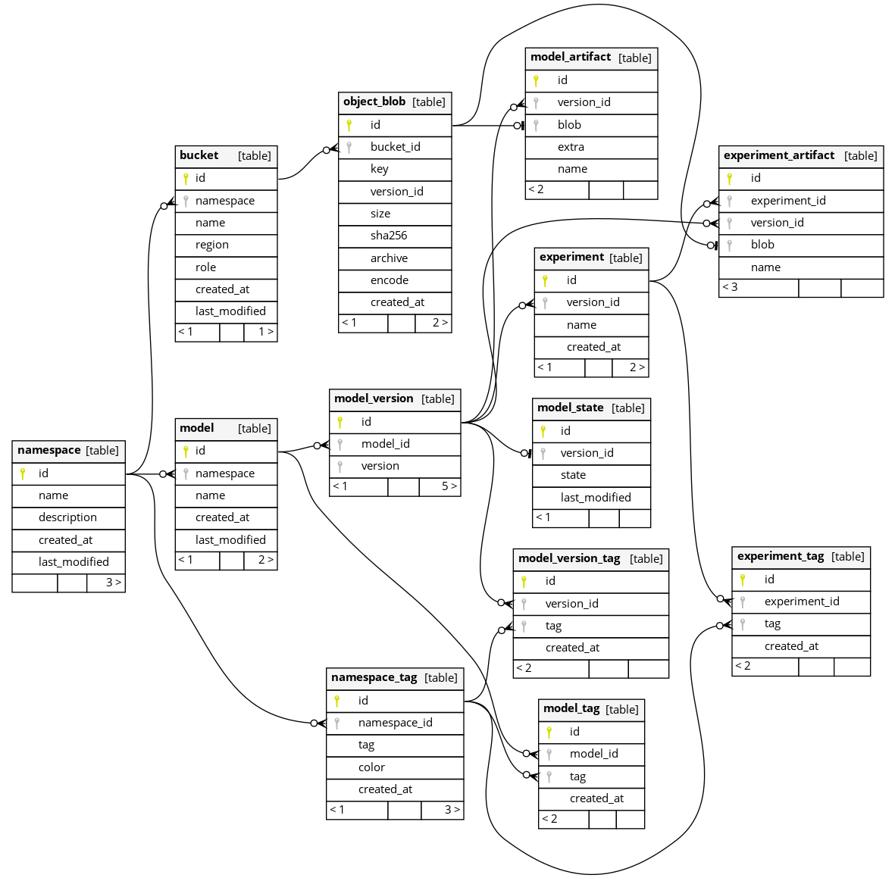

# Architecture

## Objectives

Services exist as islands, where we may opt (in) to specific services (assuming default of all).

The following layers / services:

- Query Layer
  - graphql
- Access Layer
  - authentication
    - oauth2
  - permissioning
  - user storage
- Storage Layer
  - object storage
- Tracking Layer
  - namespaces
  - models
    - artifacts
  - experiments
    - artifacts
- Audit Layer
  - logs
  - events
- Events Layer
  - webhooks

### Non-Objectives

- Non-support via obscure infrastructure dependencies
  - should support common methods of:
    - object storage
    - relational data storage

## Data Model

For data storage, we utilize SQL as a mechanism to integrate with existing infrastructure. All changes will be performed via migration based cli, which must offer migration-to and rollback-from for each subsequent change.

### Postgres

## Protocols Used

### Graphql

Graphql is used over e.g. grpc for the following reasons:

- Ability to utilize http 2 / 3
- Dynamic querying of attributes without statically defined methods

This allows for combinations of operations to occur simultaneously across different threads / servers without overhead of unneccesary fields.
