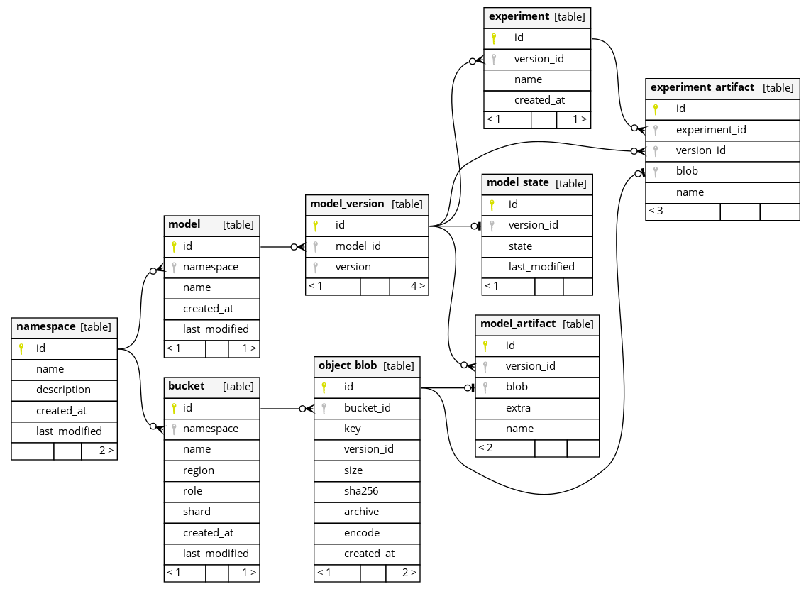

# Architecture

## Overview

Services exist as islands, where we may opt (in) to specific services (assuming default of all).

The following layers / services will be created:

- Query Layer
  - graphql
- Access Layer
  - authentication
    - oauth2
  - permissioning
  - user storage
- Storage Layer
  - object storage
- Tracking Layer
  - namespaces
  - models
    - artifacts
  - experiments
    - artifacts
- Audit Layer
  - logs
  - events
- Events Layer
  - webhooks

## Data Model

